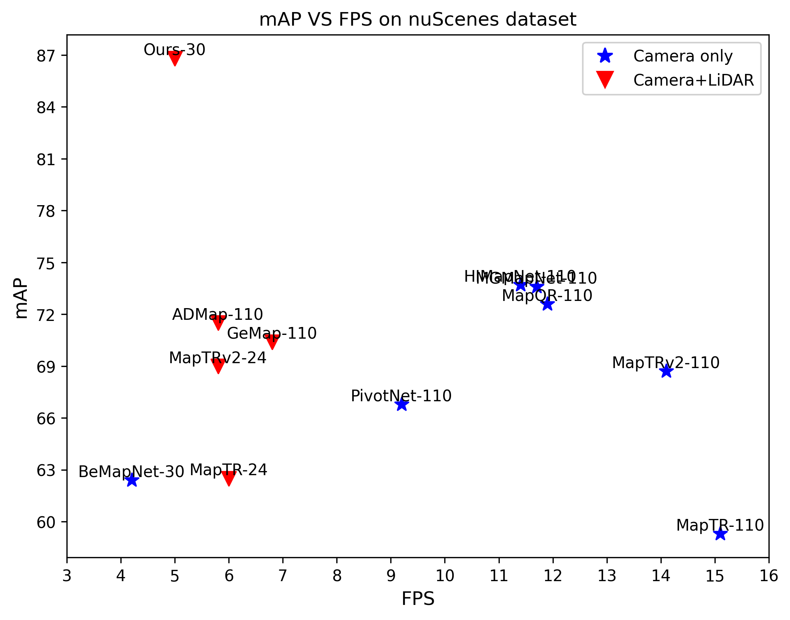
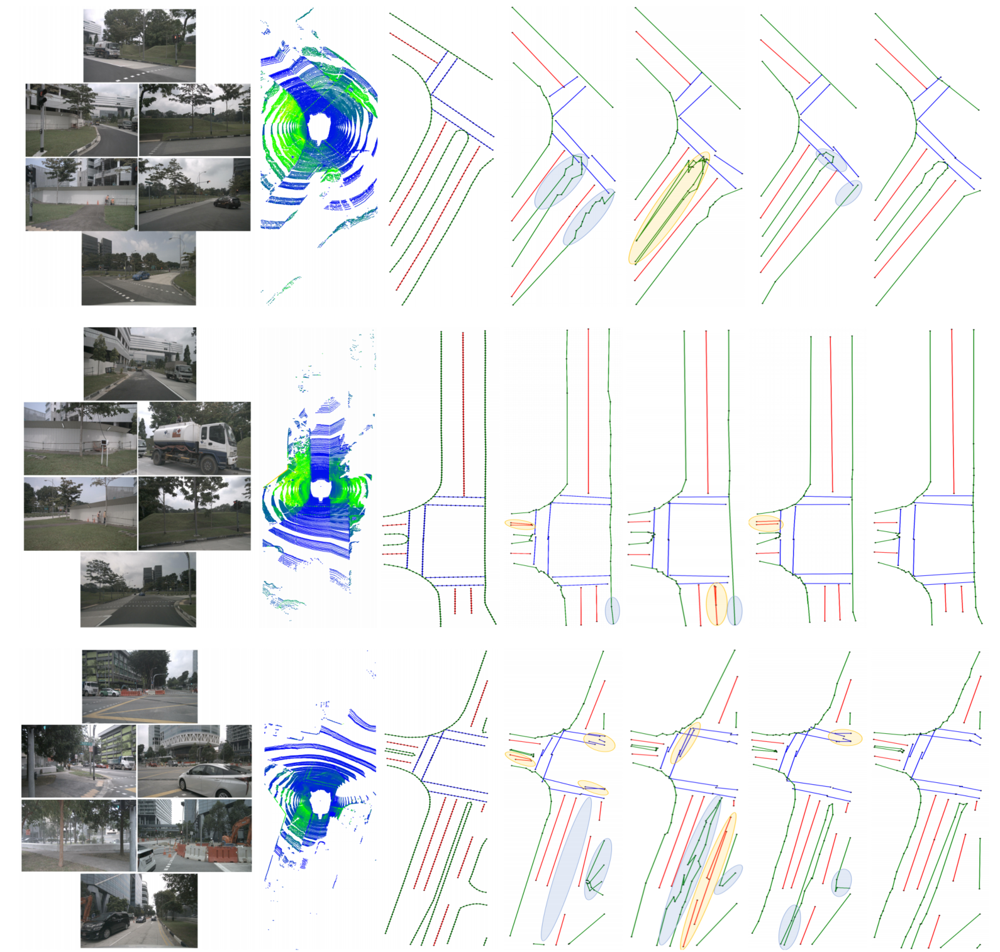
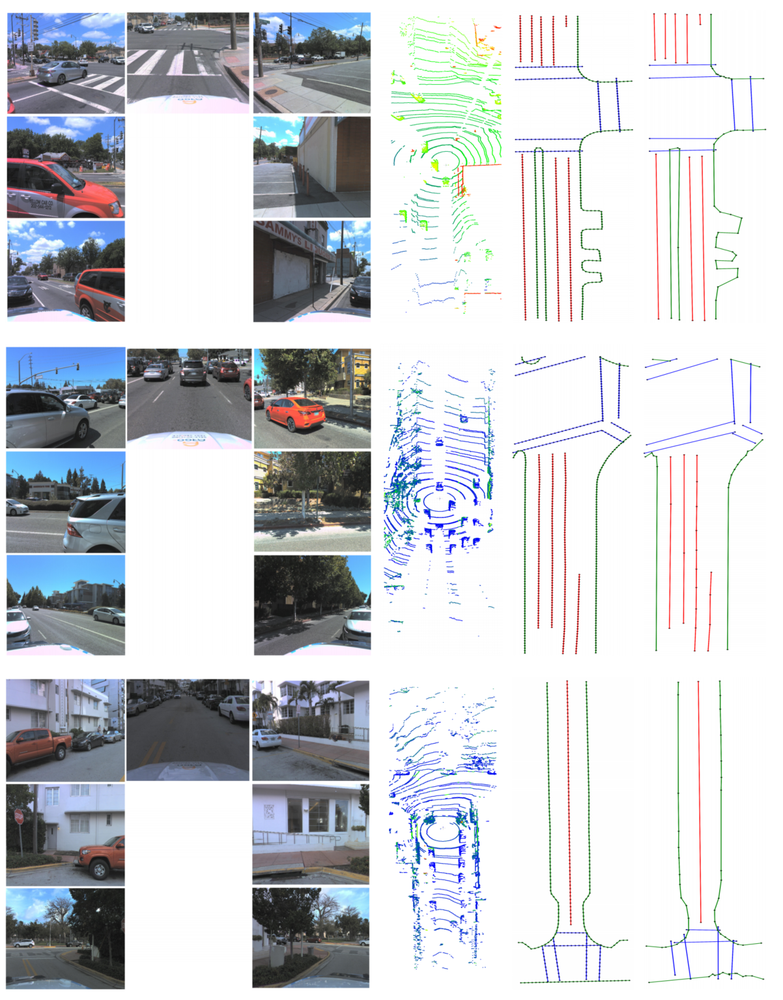
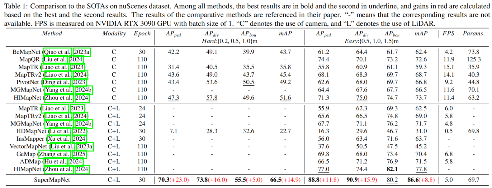
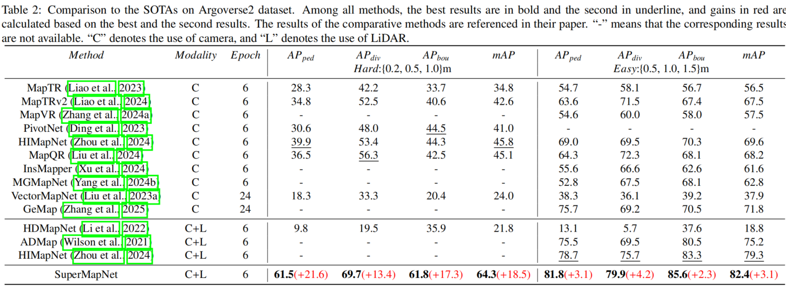

SuperMapNet for Long-Range and High-Accuracy Vectorized HD Map Construction


**[Long version on Arxiv](https://arxiv.org/abs/2505.13856) 
**[Code on github](https://github.com/zhouruqin/SuperMapNet) 

<div align="center"></div>
Fig.1: Coomparisons with SOTAs on nuscenes dataset.

<div align="center"></div>
Fig.2: Visualization comparison between different modules of SuperMapNet on nuScenes dataset, where erroneous shapes are circled in blue and entanglement
between elements are in yellow. Road boundaries are colored in green, while lane dividers and pedestrian crossings are in red and blue, respectively. Each contains
six columns, (a) camera images; (b) LiDAR point clouds; (c) ground-truth; (d) baseline; (e) baseline only with SGC module; (f) baseline only with PEC module;
and (g) baseline with both SGC and PEC modules.

<div align="center"></div>
Fig.3: Visualization of SuperMapNet on Argoverse2 dataset. Road boundaries are colored in green, while lane dividers and pedestrian crossings are in red and
blue, respectively. Each contains four columns, (a) camera images; (b) LiDAR point clouds; (c) ground-truth; (d) results predicted by SuperMapNet with both SGC
and PEC modules.

We build the released version of **SuperMapNet** upon **[PivotNet](https://github.com/wenjie710/PivotNet) project. Therefore, this project supports the reproduction of **both** PivotNet and BeMapNet.

<details open>
<summary><b>Step-by-step Installation</b></summary>
<\br><br>

- **a. Check Environment**
  ```shell
  Python >= 3.8
  CUDA 11.1
  # other versions of python/cuda have not been fully tested, but I think they should work as well.
  ```

- **b. Create a conda virtual environment and activate it. (Optional)**
  ```shell
  conda create -n pivotnet python=3.8 -y
  conda activate pivotnet
  ```

- **c. Install PyTorch and torchvision following the [official instructions](https://pytorch.org/get-started/previous-versions/).**
  ```shell
  pip3 install torch==1.10.1+cu111 torchvision==0.11.2+cu111 -f https://download.pytorch.org/whl/torch_stable.html
  ```

- **d. Install MMCV following the [official instructions](https://github.com/open-mmlab/mmcv). (need GPU)**
  ```shell
  pip3 install -U openmim
  mim install mmcv==1.7.1
  ```

- **e. Install Detectron2 following the [official instructions](https://detectron2.readthedocs.io/en/latest/tutorials/install.html).**
  ```shell
  python3 -m pip install detectron2 -f https://dl.fbaipublicfiles.com/detectron2/wheels/cu111/torch1.10/index.html
  ```

- **f. Compiling CUDA operators for Deformable Transformer.**
  ```shell
  cd mapmaster/models/bev_decoder/deform_transformer/ops
  bash make.sh
  ```

- **g. Install SuperMapNet.**
  ```shell
  git clone git@github.com:zhouruqin/SuperMapNet.git
  cd SuperMapNet
  pip3 install -r requirement.txt
  ```

</details>


<details>
<summary><b>Material Preparation</b></summary>
<\br><br>

- **a. Data: NuScenes**
  - Download&Unzip the [NuScenes](https://www.nuscenes.org/nuscenes#download) dataset into your server and link it to desirable path.
    ```shell
    cd /path/to/pivotnet
    mkdir data
    ln -s /any/path/to/your/nuscenes data/nuscenes
    ```
  - Generate Pivot/Bezier-annotations from NuScenes's raw-annotations.
    ```shell
    cd /path/to/pivotnet
    python3 tools/anno_converter/nuscenes/convert.py -d ./data # generate pivot-annotation only
    OR python3 tools/anno_converter/nuscenes/convert.py -d ./data --bezier   # generate both pivot and bezier annotatation (more time needed)
    ```

- **b. Weights: Public-Pretrain-Models**
  - Download public pretrain-weights as backbone initialization.
    ```shell
    cd /path/to/pivotnet
    cd assets/weights
    wget https://github.com/wenjie710/PivotNet/releases/download/v1.0/efficientnet-b0-355c32eb.pth .
    wget https://github.com/wenjie710/PivotNet/releases/download/v1.0/resnet50-0676ba61.pth .
    wget https://github.com/wenjie710/PivotNet/releases/download/v1.0/upernet_swin_tiny_patch4_window7_512x512.pth .
    ``` 
  
- **c. Check: Project-Structure**
  - Your project directory should be, 
    ```shell
      assets
        | -- weights (resnet, swin-t, efficient-b0, ...)
        | -- 
      mapmaster
      configs
      data
        | -- nuscenes
          | -- samples (CAM_FRONT, CAM_FRONT_LEFT, CAM_FRONT_RIGHT, ...)
          | -- annotations
          | -- v1.0-trainval
          | -- ...
          | -- customer
            | -- pivot-bezier
              | -- *.npz
      tools
    ```

</details>

<details>

<summary><b> Training and Evluation</b></summary>
<\br><br>

- **a. Model Training**
  ```shell
  CUDA_VISIBLE_DEVICES=2,3 bash run.sh train pivotnet_nuscenes_swint 30  # pivotnet, default: 8GPUs, bs=1, epochs=30
  CUDA_VISIBLE_DEVICES=0,1,2,3 bash run.sh train pivotnet_Argoverse2_swint 30
  CUDA_VISIBLE_DEVICES=0,1,2,3 bash run.sh train-continue pivotnet_nuscenes_swint /zrq/PivotNet/outputs/pivotnet_nuscenes_swint/2024-11-25T10:12:06/dump_model/checkpoint_epoch_9.pth  # train continue
  ```

- **b. Model Evaluation**
  ```shell
  CUDA_VISIBLE_DEVICES=0  bash run.sh test pivotnet_nuscenes_swint ${checkpoint-path}  # for pivotnet
  CUDA_VISIBLE_DEVICES=0  bash run.sh test pivotnet_Argoverse2_swint   ${checkpoint-path}  # for av2 dataset
  ```

</details>

## <div align="center">Models & Results</div>

<details open>

<summary><b>Results on NuScenes DataSet</b></summary>
<\br><br>
<div align="center"></div>
  
<summary><b>Results on Argoverse2 DataSet</b></summary>
<\br><br>  
<div align="center"></div>

</details>

#
## Citation
If you find SuperMapNet is useful in your research or applications, please consider giving us a star :star: and citing them by the following BibTeX entries:
```
@misc{supermapnet,
      title={SuperMapNet for Long-Range and High-Accuracy Vectorized HD Map Construction}, 
      author={Ruqin Zhou and Chenguang Dai and Wanshou Jiang and Yongsheng Zhang and Hanyun Wang and San Jiang},
      year={2025},
      eprint={2505.13856},
      archivePrefix={arXiv},
      primaryClass={cs.CV},
      url={https://arxiv.org/abs/2505.13856}, 
}

```
